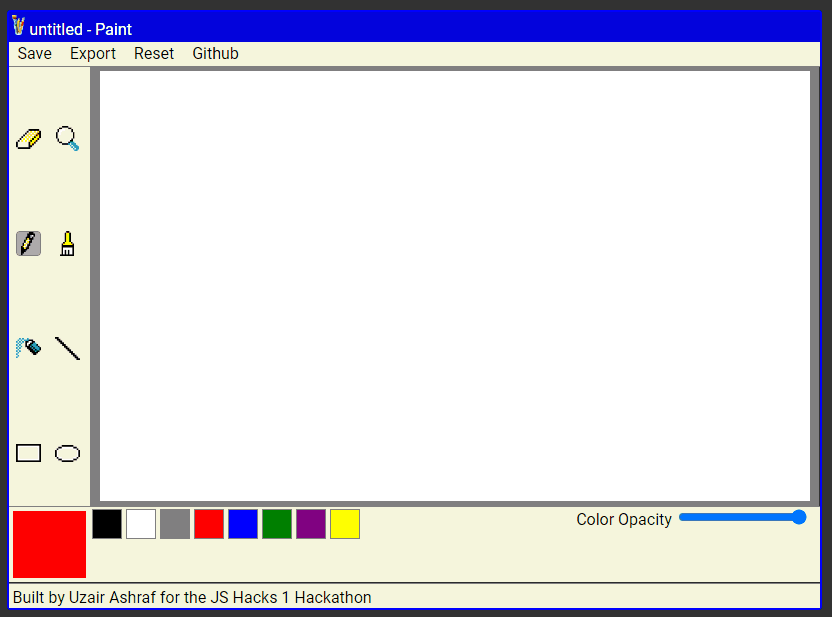

# MS Paint Clone
A vanilla JS web application to simulate MS Paint in the browser for the Mintbean JS Hacks I Hackathon

## Technologies Used
- HTML
- CSS
- Vanilla JavaScript

## Live Link

Play the live demo [here.](https://ms-paint.uzairashraf.dev)

## Preview

## Feature List

- User can draw with pencil
- User can draw with brush
- User can spray dots
- User can change color opacity
- User can make straight lines
- User can make circles
- User can erase
- User can zoom
- User can reset canvas
- User can save drawings to local storage
- User can export canvas as an image
